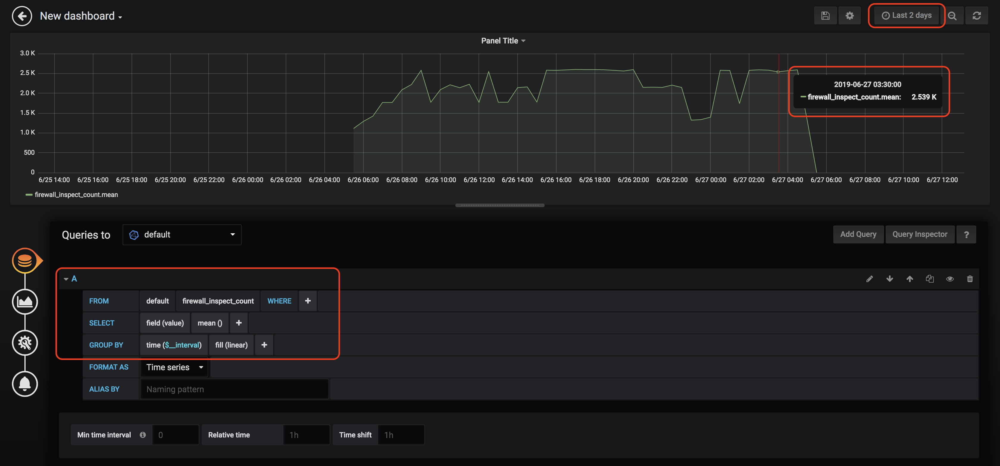
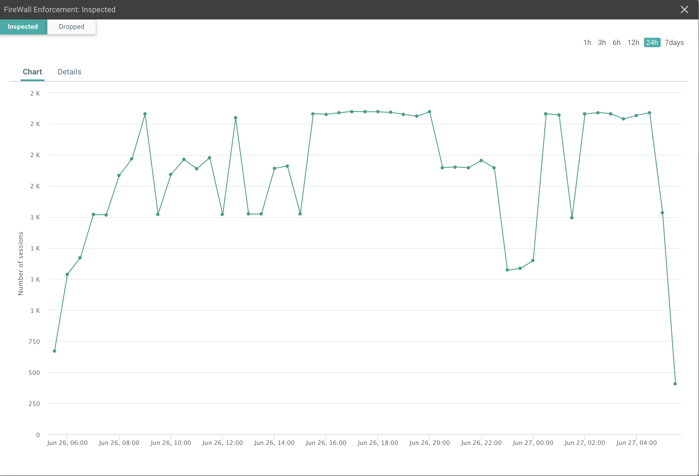
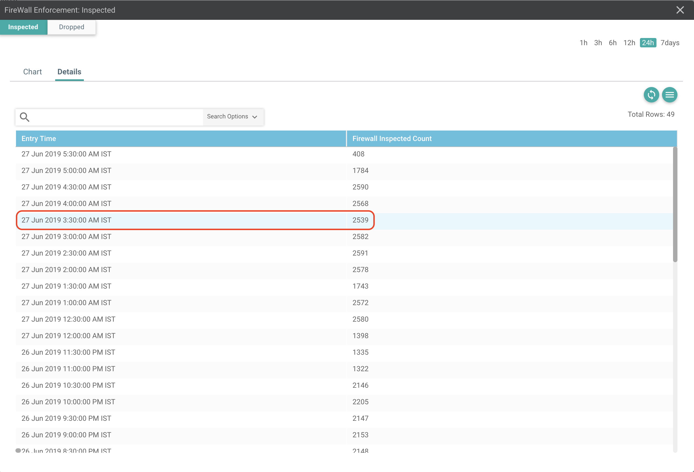

[](https://developer.cisco.com/codeexchange/github/repo/suchandanreddy/sdwan-integration-with-influxdb-grafana)

# Objective

How to retrieve the firewall inspect counter values, store firewall inspect count values in a Time Series Database (TSDB) Influx DB and plot it on to Grafana Dashboard.

# Install and Setup

Clone the code to local machine.

```
git clone https://github.com/suchandanreddy/sdwan-integration-with-influxdb-grafana.git
cd sdwan-integration-with-influxdb-grafana
```

Setup Python Virtual Environment (requires Python 3.7+)

```
python3.7 -m venv venv
source venv/bin/activate
pip3 install -r requirements.txt
```

## Influxdb Installation

Install Influxdb - `brew install influxdb`

## Grafana Installation

Install Grafana -  `brew install grafana`

Verify homebrew/services is installed before starting the Grafana service - `brew tap homebrew/services`

Start Grafana service - `brew services start grafana`

## Resource URL Structure Components

In order to retrieve firewall statistics i.e. inspect count, drop count we need to use the resource URL "/statistics/fwall/aggregation"

URL : https://<vmanage-ip:port>/dataservice/statistics/fwall/aggregation

| Component  | Description  |
| ------ | ------ |
| http:// or https://  | Protocol over which data is sent  between client and server |
| Server or Host  | Resolves to the IP and port to which to connect, example : "<vmanage-ip:port>" |
| Resource | The location of the data or object of  interest, example : "statistics/fwall/aggregation" |

Now let’s start using the python script to fetch the firewall inspect and drop count by using below steps

  - login and authenticate to a vManage instance
  - Build Query to specify the rules and how to collect firewall statistics. 
  - Perform the POST operation by sending query in payload

In order to retrieve the firewall statistics we need to send Query which describes how statistics should be aggregated. 

Now let's define the Query which can be used to collect firewall statistics using POST operation on Resource URL "/dataservice/statistics/fwall/aggregation"

## Query Payload

### Example-1

-	Below example query retrieves firewall inspect count values for last 24 hours from all network devices in fabric.

-	The aggregation portion of the query determines how data is bucketized/grouped. 

-	Here, the statistics are aggregated in 30 mins intervals across the span of 24 hours.

```
{
"aggregation": {			                # Defines how statistics are bucketized  
"metrics": [
      {
        "property": "fw_total_insp_count",  # Bucketized based on property for example   
        "type": "sum",                        firewall total inspect packet count
        "order": "desc"
      }
    ],
    "histogram": {.                         # Time interval is 30 mins
      "property": "entry_time",
      "type": "minute",
      "interval": 30,
      "order": "asc"
    }
  },
  "query": {
    "condition": "AND",         # Aggregated data must match both the rules specified below
    "rules": [
      {
        "value": [
          "24"				                Rule #1: Statistics from the last 24 hours
        ],
        "field": "entry_time",
        "type": "date",
        "operator": "last_n_hours"
      },
      {
        "value": [
          "total"			                Rule #2: Total packets count for firewall inspect
        ],
        "field": "type",
        "type": "string",
        "operator": "in"
      }
    ]
  }
}

```

Using the above query let's perform POST operation on URI to retrieve the firewall inspect count statistics for last 24 hours in intervals of 30 mins. 

## POST Operation

To fetch the ZBF inspect packet count or drop count we need to perform POST operation by sending the query in payload. 

**Sample Response**

`entry_time` values are in epoch format and correspending key `fw_total_insp_count` contains the firewall inspect count value at that `entry_time`. 

```
Firewall Inspect count

  "data": [
    {
      "entry_time": 1552807800000,
      "count": 92,
      "fw_total_insp_count": 278
    },
    {
      "entry_time": 1552806000000,
      "count": 360,
      "fw_total_insp_count": 1050
    },
    {
      "entry_time": 1552804200000,
      "count": 360,
      "fw_total_insp_count": 1052
    },
    {
      "entry_time": 1552802400000,
      "count": 360,
      "fw_total_insp_count": 1051
    },
<snip>  
```

## Influx DB:

 -	InfluxDB is an open-source time series database which is optimized for fast, high-availability storage and retrieval of time series data in fields such as operations monitoring, application metrics, Internet of Things sensor data, and real-time analytics. It provides a SQL-like language with built-in time functions for querying a data structure composed of measurements, series, and points
 
-	Grafana is an open-source platform to build monitoring and analytics dashboards. 

Here, we are using InfluxDB as a datasource for Grafana to plot the information on dashboard. 

###	Connect to InfluxDB

**Step-1:**

Run the command **influx** to connect to influx DB CLI and create database to store firewall inspect count values

**Sample Response**

```
$ influx
Connected to http://localhost:8086 version v1.7.6
InfluxDB shell version: v1.7.6
Enter an InfluxQL query
```


**Step-2:**

In Influx CLI prompt, run the command `CREATE DATABASE firewall_inspect` to create `firewall_inspect` database.

Create command doesn't produce any output, but when we run `SHOW DATABASES` command we can see it in the list

**Step-3:**

Run command `SHOW DATABASES` to see the created firewall_inspect database. 

**Sample Response**

```
> SHOW DATABASES
name: databases
name
----
_internal
firewall_inspect
```

**Step-4:**

Now run the command `python3 firewall_statistics_api.py` to retrieve the statistics from vManage and insert the data in to InfluxDB. 

Here we have retrieved 49 firewall inspect count samples for last 24 hours and have written that data in to Influx DB.  

**Sample Response**

```
$python3 firewall_statistics_api.py
Create a retention policy
Write points #: 49
```

Now let's plot these firewall inspect count values on a Grafana dashboard 

## Grafana

Note: Below screenshots are for Grafana version 6.1.6

**Step-1:**

Use web browser and login to Grafana at http://localhost:3000/  (Username/Password:admin/admin) . After login, we will see below home screen.


**Step-2:**

Select Add Data Sources and select Influx DB. 


**Step-3:**

Provide Influx DB details i.e. URL, username/password i.e. admin/admin and Database name i.e. firewall_inspect.


**Step-4:**

Select Save and Test option and check if Data source is working.


### Create a Dashboard

**Step-5:** 

Create Dashboard by selecting New dashboard option


**Step-6:**

Select **Add Query** and define Query to retrieve the values from database. 
 


We have to query `firewall_inspect_count` values from Influx DB using below conditions.

**FROM** : default,firewall_inspect_count<br>
**GROUP BY** : time($_interval),fill(linear)<br>

Now Grafana sends query to influx DB and plots the graph on Dashboard as seen below.



-	Above graph corresponds to this below plot on vmanage. At 27 June 2019, 3.30 AM IST, we can see the firewall inspect count value as 2539 which is same value as seen on vManage. 

## Firewall Inspect Count Chart



## Firewall Inspect Count Details



